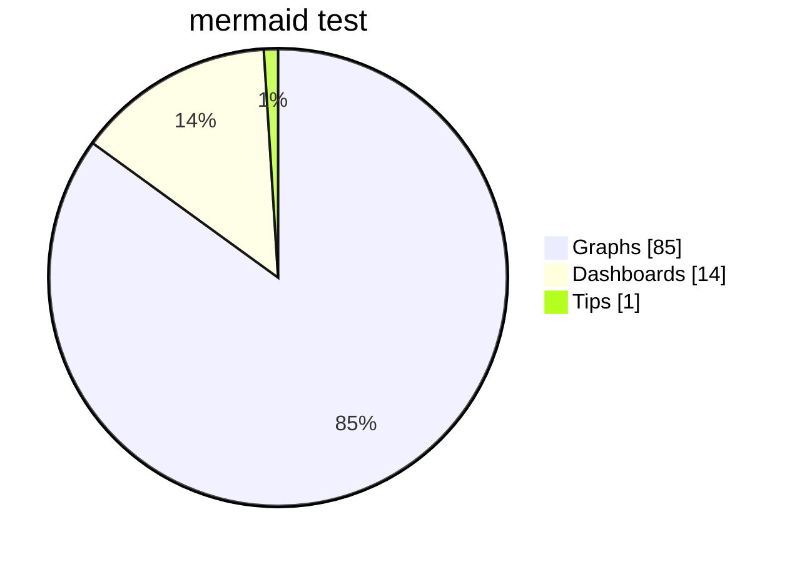

# Demo - Page using Chripy & Obsdian 
## Introduction

 Written in [^1]Obsidian and post to github pages 

## Prompts

> [!TIP]
> Example line for prompt.
{: .prompt-tip }

> [!WARNING]
> Example line for prompt.
{: .prompt-warning }

> [!DANGER]
> Example line for prompt.
{: .prompt-danger }

> [!INFO]
> Example line for prompt.
{: .prompt-info }

## Mermaid 

## Math

$$
Quadratic formula: x = \frac{-b \pm \sqrt{b^2 - 4ac}}{2a}
$$

## Media 
### Image
#### Size 

{: width="500" height="500" }
#### Shadow 
{: .shadow }
### Video 
#### Manual


#### Auto


## Footnotes 

[^1]: [obsdian](https://www.google.com)
	getjb
