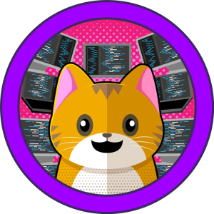

# Synopsis




| Machine    | [Meow](https://app.hackthebox.com/machines/Meow?sort_by=created_at&sort_type=desc) |
| ---------- | ---------------------------------------------------------------------------------- |
| OS         | Linux                                                                              |
| Difficulty | Easy                                                                               |
| Released   | 30th September, 2021                                                               |
| Created by | [HTB-Bot](https://app.hackthebox.com/users/16)                                     |


>[!summary]
>- Step 1
>- Step 2
## Improved skills
## Used tools

- rustscan / nmap 
- telnet 
---
# Commands & Payloads

## Reconnaissance

```sh
sudo nmap -sC -sV -p 10.129.97.196
```

- found port: `23`
## Enumeration

### Telent (TCP/23)
```sh
telnet 10.129.97.196
```

> Creds Needed 

## Exploitation

> Web search common creds for 

`root:(blank)` creds work

**shell**: `root`
> flag in current directory 

```sh
ls 
cat flag.txt
```

## Lateral Movement

### Local enumeration

### Lateral movement vector


## Privilege Escalation

### Local enumeration
### Privilege Escalation vector

# Resources

- 
- 

## External Writeup 

`<iframe width="660" height="415" src="https://www.youtube.com/embed/XXXXXX" title="YouTube video player" frameborder="0" allow="accelerometer; autoplay; clipboard-write; encrypted-media; gyroscope; picture-in-picture" allowfullscreen></iframe>`

- Ippsec 
- 0xdf
---
# Trophies

- [ ] **user.txt**
- [ ] **root.txt**


| Task | Question                                                                                                                                                                                       | Answer                           |
| ---- | ---------------------------------------------------------------------------------------------------------------------------------------------------------------------------------------------- | -------------------------------- |
| 1    | In cybersecurity, isolated environments—like Pwnbox or the vulnerable target machines—are often VMs. What does VM stand for?                                                                   | Virtual Machine                  |
| 2    | What tool do we use to interact with the operating system in order to issue commands via the command line, such as the one to start our VPN connection? It's also known as a console or shell. | terminal                         |
| 3    | What service do we use to form our VPN connection into HTB labs?                                                                                                                               | openvpn                          |
| 4    | What tool do we use to test our connection to the target with an ICMP echo request?                                                                                                            | ping                             |
| 5    | What is the name of the most common tool for finding open ports on a target?                                                                                                                   | nmap                             |
| 6    | What service do we identify on port 23/tcp during our scans?                                                                                                                                   | telnet                           |
| 7    | What username is able to log into the target over telnet with a blank password?                                                                                                                | root                             |
| 8    | Submit the flag located in root's home directory.                                                                                                                                              | b40abdfe23665f766f9c61ecba8a4c19 |

---
# Proof 


---
# Conclusion

---

# Table of Content 

%% Begin Waypoint %%
- [00-Pre-Engagement](<./00-Pre-Engagement.md>)
- [01-Reconnaissance](<./01-Reconnaissance.md>)
- [02.1-Enumeration](<./02.1-Enumeration.md>)
- [02.2-Vulnerability-Analysis](<./02.2-Vulnerability-Analysis.md>)
- [03-Exploitation](<./03-Exploitation.md>)
- [04-Privilege-Escalation](<./04-Privilege-Escalation.md>)
- [05-Post-Exploitation](<./05-Post-Exploitation.md>)
- [06-Remediation](<./06-Remediation.md>)

%% End Waypoint %%

---
